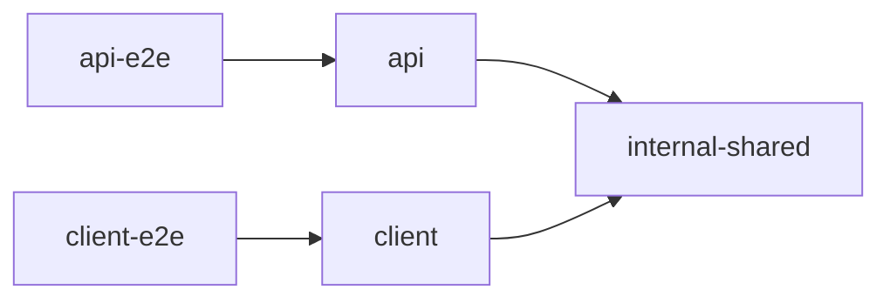

# reelscore

Football livescore web application with a focus on match predictions and team form ratings.

The project is organized as an [Nx](https://nx.dev) monorepo and contains the reelscore client and API.

Architectural decisions and technical details are documented in [/docs](./docs/README.md).

## Requirements

- Node.js 24
- npm
- Docker (for running the local test dependencies)

Install all dependencies:

```bash
npm install
```

### Environment Variables

The applications require environment-specific configuration.

```env
API_PORT=
MONGODB_USER=
MONGODB_PASSWORD=
MONGODB_CLUSTER=
MONGODB_DATABASE=
```

## Project Overview

### Tech Stack

| Technology       | Used for          | Version |
| ---------------- | ----------------- | ------- |
| Node.js          | Runtime           | `24.x`  |
| Nx               | Workspace tooling | `22.x`  |
| Angular          | Client            | `21.x`  |
| Angular Material | Client UI         | `21.x`  |
| NgRx             | Client state      | `21.x`  |
| Tailwind CSS     | Client styling    | `3.x`   |
| Express          | API               | `4.x`   |
| Mongoose         | API database      | `8.x`   |
| TypeScript       | Client and API    | `5.x`   |

### Repository Structure

The main applications are located under `apps/`:

```text
apps/
├── api/
└── client/
```

Project-specific helpers shared by the client and API are stored under
`lib/shared/`.
Shared API models, constants and helpers are maintained in the separate
[`reelscore-sdk`](https://github.com/svenson95/reelscore-sdk) package and installed
here as a versioned npm tarball. To update them, change the SDK source and
regenerate, test and pack a new version; then update this project's package
artifact and lockfile.

Additional project documentation and architectural decisions are stored under:

```text
docs/
└── decisions/
```

### Nx project dependencies

This diagram is generated from the Nx project graph. It shows dependencies
between Reelscore applications, end-to-end projects and Nx libraries. It does not
show the folders or files inside an application.

<!-- nx-architecture:start -->



<!-- nx-architecture:end -->

To open the interactive Nx project graph locally, run:

```bash
npx nx graph
```

## Infrastructure

### Data Source

Football data is provided by [API-Football](https://www.api-football.com/) through RapidAPI.

This project does not communicate with API-Football directly. All application data is retrieved exclusively from the project's own database.

### Hosting

The client and API are both hosted on Vercel.

The Angular client is built and deployed as a static web application. The Node.js/Express API is deployed as Vercel Serverless Functions.

## Development

### Start client and API

To start both applications in parallel:

```bash
npm run dev
```

Alternatively:

```bash
npx nx run-many --parallel --target=serve --projects=api,client
```

### Start client

```bash
npx nx serve client
```

The exact local URL depends on the configured Angular development server.

### Start API

```bash
npx nx serve api
```

## Build

### Build client

```bash
npx nx build client
```

### Build API

```bash
npx nx build api
```

Build artifacts are written to the Nx output directory, usually:

```text
dist/
```

### Build all applications

```bash
npx nx run-many -t build -p client api
```

## Testing

Run unit and component tests for a project:

```bash
npx nx test <project>
```

Example:

```bash
npx nx test client
```

Run tests for all configured projects:

```bash
npx nx run-many -t test
```

### End-to-End Tests

The API E2E suite needs the environment variables listed above:

```bash
npx nx e2e api-e2e
```

The client E2E suite also needs the environment variables above and Playwright
Chromium. Install the browser once with:

```bash
npx playwright install chromium
```

Then run the browser tests with the API on port `3333`:

```bash
API_PORT=3333 npx nx e2e client-e2e --project=chromium
```

## Code Quality

Run linting for a project:

```bash
npx nx lint <project>
```

Or lint all configured projects:

```bash
npx nx run-many -t lint
```

Formatting and linting should be checked before creating a pull request.

## Scripts

Project-specific utility scripts are used for maintenance tasks such as downloading and processing team and competition logos.

Scripts should be executed deliberately and their generated output should be reviewed before replacing existing assets.

### Resize team and competition logos

We use responsive logo variants for team and competition images.

The logo resize script uses sharp to generate multiple PNG variants for each source image. The baseSize defines the target size of the generated images. Before running the script, `inputDir` and `outputBaseDir` must be configured for the corresponding asset type (team-logo or competition).

Example sizes for 14x14 images:

| Variant | Size       |
| ------- | ---------- |
| `@1x`   | 14 × 14 px |
| `@2x`   | 28 × 28 px |
| `@3x`   | 42 × 42 px |

The generated images preserve their aspect ratio and are placed inside a transparent square canvas.

Run inside `apps/client/src/assets/images`:

```bash
node resize-logos.script.js
```

The script expects the source images in:

```text
./team-logo/
```

Generated files are written to, for example:

```text
./team-logo-responsive/14x14/
```

#### Step-By-Step resize logos

1. Download the team & competition logos and move them to the expected input directory.

2. Set the `baseSize`, `inputDir` and `outputBaseDir`.

3. Run the logo processing script.

4. Inspect the git changes & compare updated logos with the currently used assets. Keep the existing logo when it has better visual quality.

   For example, an older logo may have a proper transparent background while a newly provided version does not.

Generated files should therefore **not automatically replace existing assets**.

### Generate Xcode Assets

The `generate_xcassets.py` script converts prepared PNG images into Xcode-compatible `.imageset` directories.

Each generated image set contains the available `1x`, `2x` and `3x` variants as well as the required `Contents.json` file.

#### Script requirements

- Python 3
- Prepared PNG files following the Xcode scale naming convention:

```text
1@1x.png
1@2x.png
1@3x.png
```

The part before `@` is used as the team or asset ID.

> [!NOTE]
> The script recursively searches the input directory for `.png` files. Files that do not follow the `<id>@<scale>.png` naming convention are skipped.

#### Usage generate_xcassets

```bash
python3 generate_xcassets.py <input_dir> <output_dir> [prefix]
```

Example:

```bash
python3 generate_xcassets.py \
  ./team-logo-responsive/14x14 \
  ./output \
  team_logo_14x14
```

The `prefix` argument is optional and defaults to `team`.

For the example above, files such as:

```text
1@1x.png
1@2x.png
1@3x.png
```

are converted into:

```text
output/
└── team_logo_14x14_1.imageset/
    ├── team_logo_14x14_1.png
    ├── team_logo_14x14_1@2x.png
    ├── team_logo_14x14_1@3x.png
    └── Contents.json
```

The generated `.imageset` directories can then be copied into the corresponding Xcode `Assets.xcassets` asset catalog.

> [!WARNING]
> If an `.imageset` with the same generated name already exists in the output directory, it is deleted and recreated.

The script also reports missing `1x`, `2x` or `3x` variants in the console. Review these warnings before copying the generated assets into Xcode.
